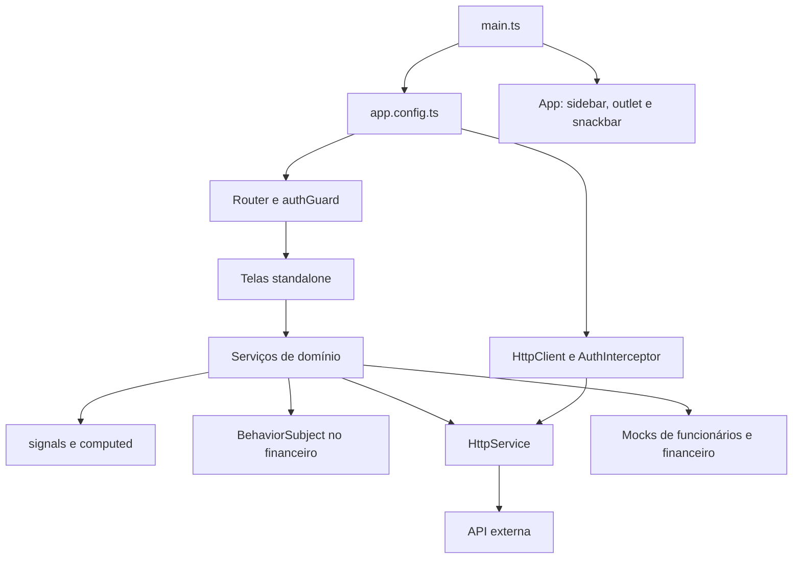

# Arquitetura

Aplicação Angular 20.3 com componentes standalone. TypeScript 5.9 em modo estrito; SCSS para componentes e estilos globais. Usa RxJS, ngx-mask e ngx-quill/Quill. Não há NgRx ou NgModules de domínio. A palavra `modules` no caminho representa agrupamento funcional.

## Inicialização

`src/main.ts` chama `bootstrapApplication(App, appConfig)`. `app.config.ts` registra router, listeners globais de erro, Zone.js com `eventCoalescing` e cliente HTTP com interceptor funcional. `App` acompanha os sinais de funcionário e snackbar, instancia `ThemeService` e fornece ngx-mask. A sidebar é exibida quando há funcionário autenticado. As rotas importam os componentes diretamente, sem `loadComponent` ou `loadChildren`; o editor Quill possui chunk separado no build.

## Organização

| Local | Responsabilidade |
| --- | --- |
| `src/app/modules` | Telas e serviços de cada domínio |
| `src/@shared/auth` | Estado de sessão e guard |
| `src/@shared/interceptors` | Bearer token e tratamento de 401 |
| `src/@shared/services` | Transporte HTTP, datas e menu |
| `src/@shared/components` | UI reutilizável |
| `src/@shared/types` | Interfaces das entidades |
| `src/@shared/mockups` | Fixtures utilizadas pela aplicação |
| `src/@shared/styles` | Design tokens, utilitários, componentes e animações |
| `environments` | URL da API; diretório ignorado pelo Git |

Não há alias TypeScript definido no `tsconfig.json`: os imports usam caminhos relativos. Nomes existentes variam entre kebab-case e PascalCase (`CustomDate`, `AuthInterceptor`, tipos); preserve o padrão do arquivo afetado em alterações pontuais.

## Estado e ciclo de vida

Auth, tema, snackbar, pacientes, funcionários e clínica expõem `signal`/`computed`. Financeiro usa `BehaviorSubject` e templates com `async`. Chamadas HTTP são Observables convertidos em Promises com `firstValueFrom` nos serviços de API. Muitos componentes mantêm loading próprio; isso não equivale ao loading do serviço.

Os caches são memória de serviços `providedIn: 'root'`, com duração da instância da aplicação. Não há TTL, persistência ou invalidação central. O logout limpa funcionário/token, mas não limpa caches de domínio. `Agenda` modifica `employee.tasks` durante o cálculo de layout, afetando objetos compartilhados com cache. Considere esses efeitos ao implementar mudanças.

## Fluxo de uma alteração

Uma funcionalidade normalmente atravessa tipo → serviço → componente → template → estilo, com registro em rota e navegação quando necessário. Tipos não validam respostas em runtime. Contratos de escrita devem ser confirmados antes de integrar áreas hoje simuladas. Os achados sobre sessão e HTML de prontuários estão em [diagnostico.md](diagnostico.md).
